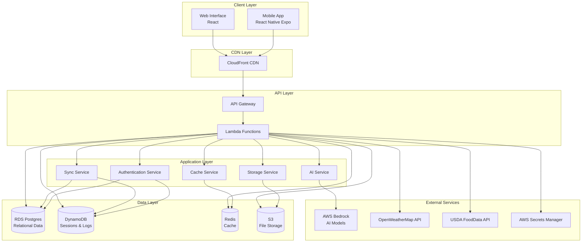
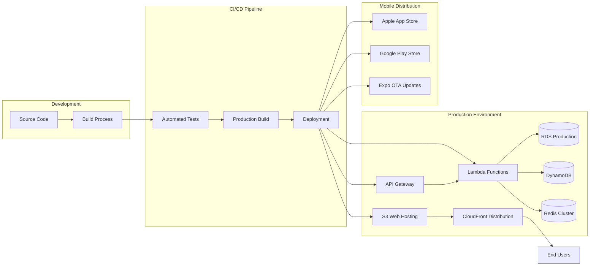
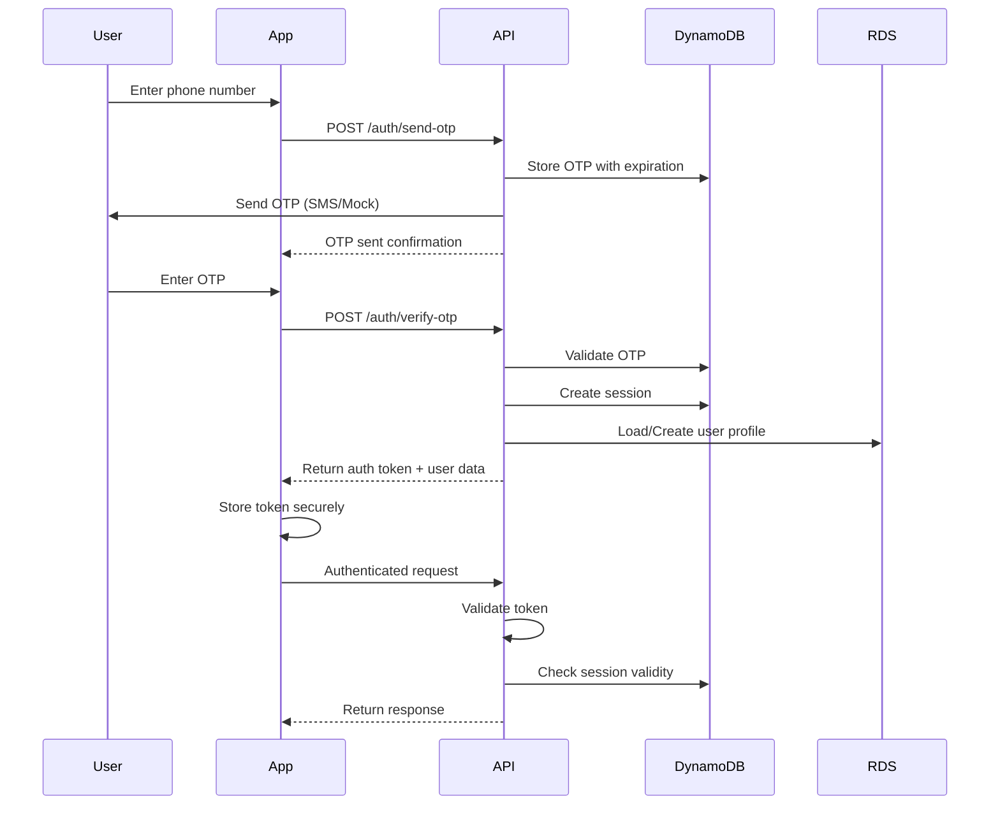
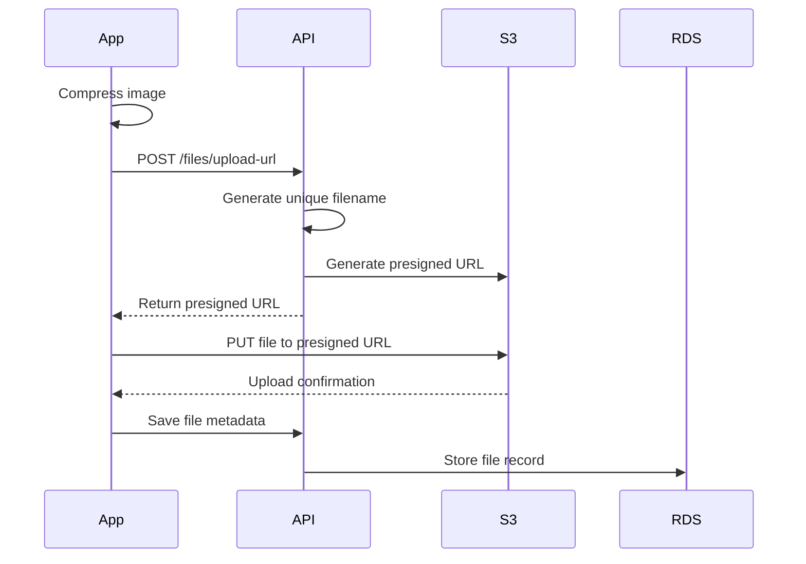
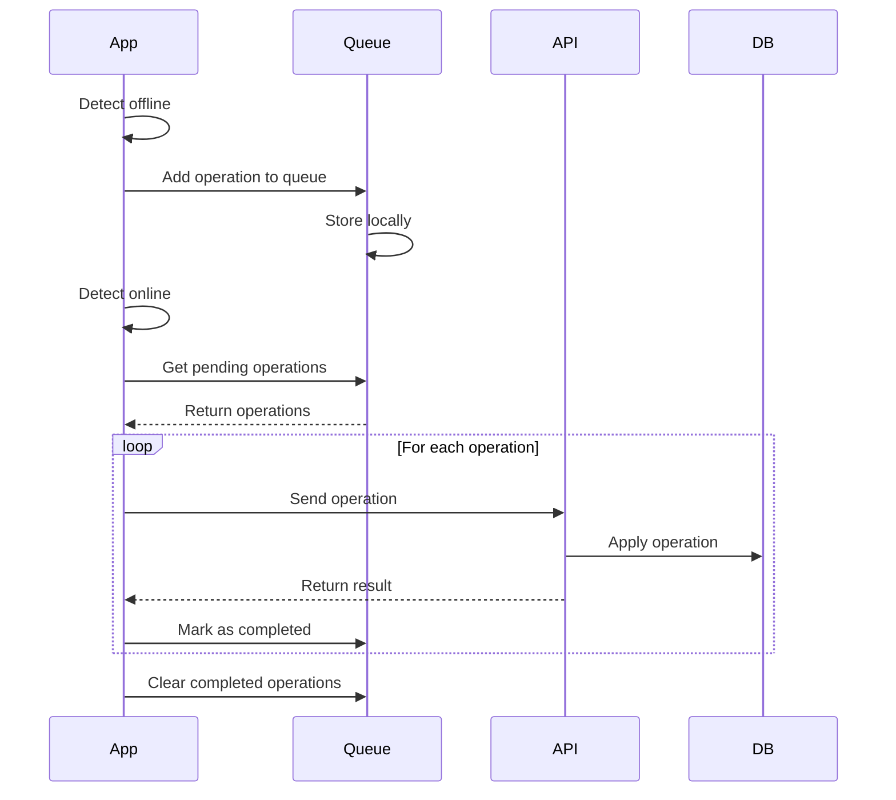
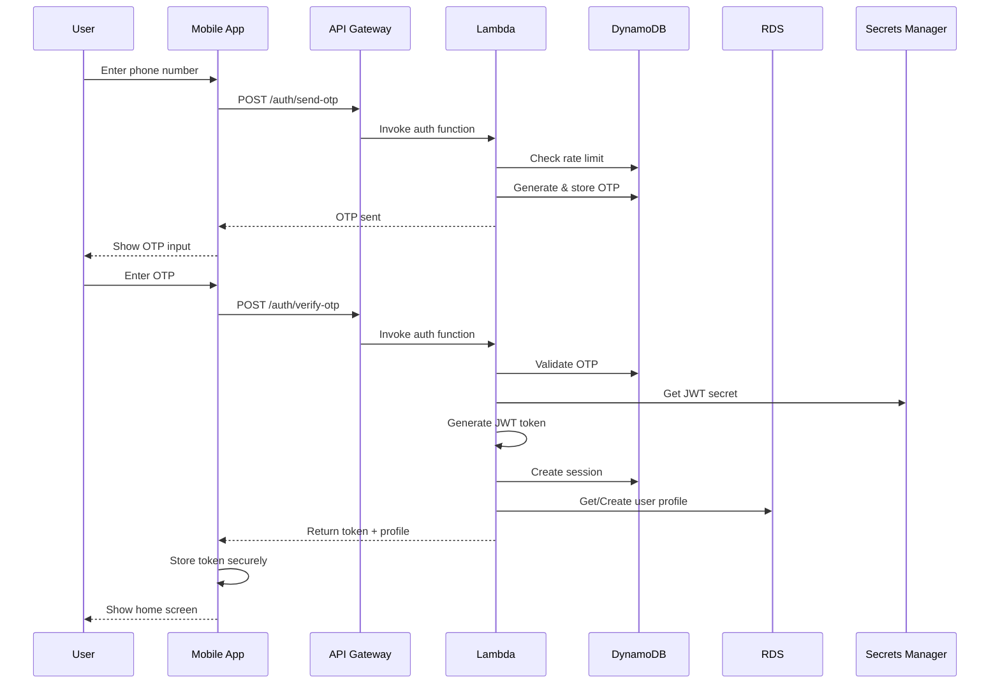
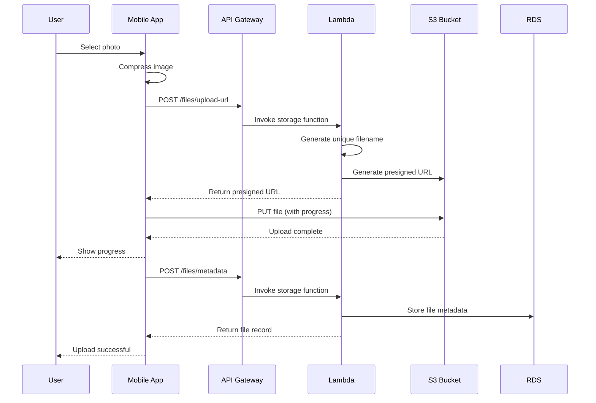
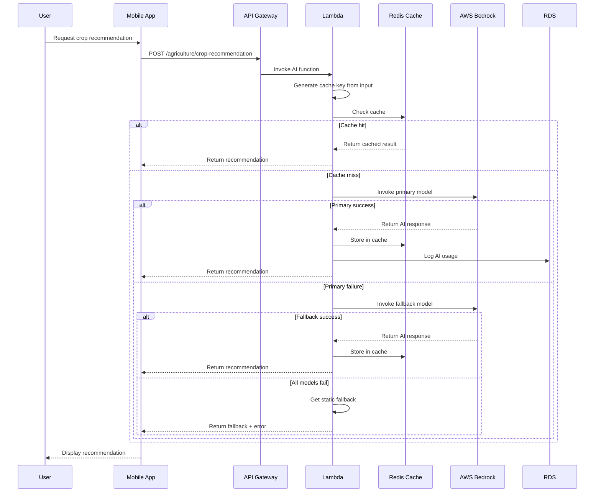
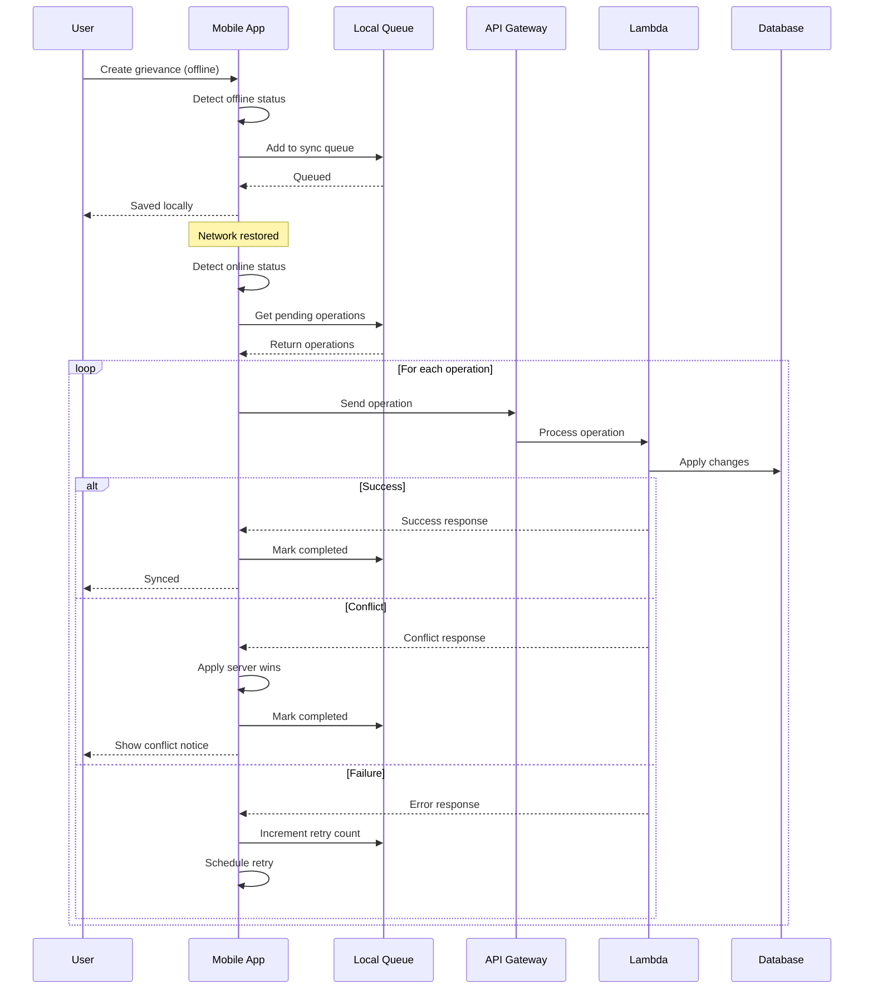
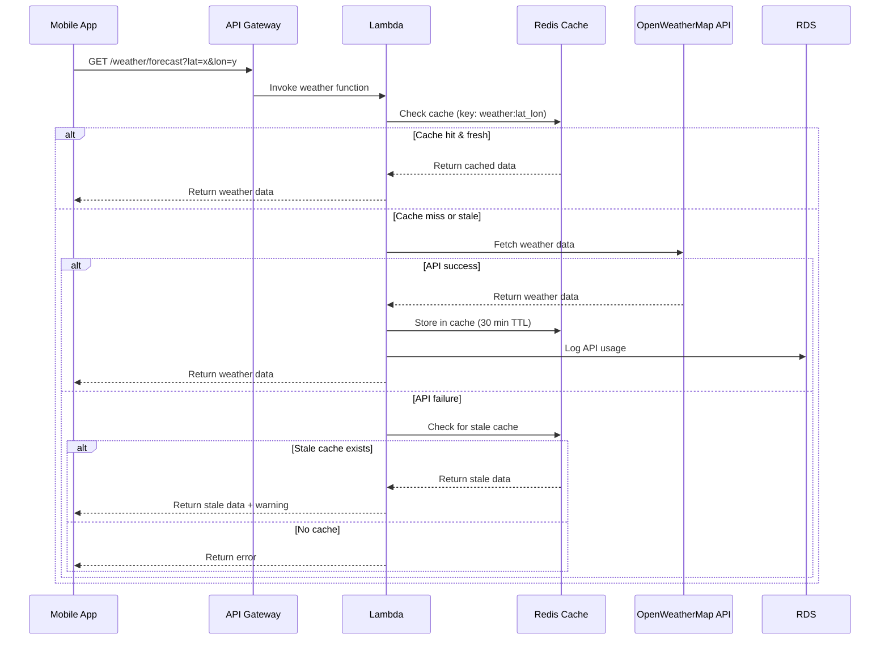

# Production Deployment Design Document

## Overview

This design document specifies the architecture and implementation strategy for deploying the RuralConnect AI application to production. The system transforms from a development environment with mock data into a production-ready application integrated with AWS services, real-time data sources, and enterprise-grade features.

The deployment encompasses:
- Mobile application (React Native Expo) for iOS and Android
- Web interface for desktop and mobile browsers
- Backend API infrastructure on AWS
- Multi-region content delivery
- Secure authentication and session management
- AI-powered features using AWS Bedrock
- Multi-language support (English, Hindi, Telugu)
- Offline-first architecture with synchronization

The design prioritizes reliability, security, performance, and accessibility for users in rural areas with limited connectivity.

## Architecture

### System Architecture Overview



### Deployment Architecture



### Multi-Region Architecture

The system uses AWS CloudFront for global content delivery with edge locations optimized for target regions. The backend API is deployed in us-east-1 with the following considerations:

- CloudFront edge locations cache static content globally
- API Gateway provides low-latency access through CloudFront integration
- S3 serves as origin for static assets with cross-region replication for disaster recovery
- RDS uses Multi-AZ deployment for high availability
- DynamoDB uses global tables for session data replication (if multi-region expansion needed)

## Components and Interfaces

### Mobile Application (React Native Expo)

The mobile application is built with React Native and Expo, providing native experiences on iOS and Android.

**Key Components:**
- Authentication Module: Handles OTP-based login and session management
- Offline Storage: Local SQLite database for offline data persistence
- Sync Engine: Manages data synchronization when connectivity is restored
- File Upload Manager: Handles image compression and S3 uploads with retry logic
- i18n Manager: Manages language selection and translation loading
- API Client: Centralized HTTP client with authentication, timeout, and error handling

**Technology Stack:**
- React Native 0.72+
- Expo SDK 49+
- React Navigation for routing
- AsyncStorage for secure token storage
- expo-secure-store for sensitive data
- expo-file-system for file operations
- react-native-i18n for internationalization
- axios for HTTP requests

**Build Configuration:**
```json
{
  "expo": {
    "name": "RuralConnect AI",
    "slug": "ruralconnect-ai",
    "version": "1.0.0",
    "orientation": "portrait",
    "icon": "./assets/icon.png",
    "splash": {
      "image": "./assets/splash.png",
      "resizeMode": "contain",
      "backgroundColor": "#ffffff"
    },
    "updates": {
      "fallbackToCacheTimeout": 0,
      "url": "https://u.expo.dev/[project-id]"
    },
    "assetBundlePatterns": ["**/*"],
    "ios": {
      "supportsTablet": true,
      "bundleIdentifier": "com.ruralconnect.ai",
      "buildNumber": "1.0.0"
    },
    "android": {
      "adaptiveIcon": {
        "foregroundImage": "./assets/adaptive-icon.png",
        "backgroundColor": "#FFFFFF"
      },
      "package": "com.ruralconnect.ai",
      "versionCode": 1
    },
    "extra": {
      "eas": {
        "projectId": "[project-id]"
      }
    }
  }
}
```

### Web Interface

The web interface provides access to RuralConnect AI through browsers, with responsive design for mobile, tablet, and desktop.

**Key Components:**
- Landing Page: Marketing content with app download links
- QR Code Generator: Dynamic QR code for mobile app download
- Responsive Layout: Adapts to screen sizes from 320px to 4K
- Progressive Web App: Service worker for offline capability
- Analytics Integration: User behavior tracking

**Technology Stack:**
- React 18+
- Vite for build tooling
- Tailwind CSS for styling
- React Router for navigation
- QR Code library for app download
- i18next for internationalization

**Deployment:**
- Built as static site
- Hosted on S3 with static website hosting
- Served through CloudFront with HTTPS
- Cache headers: 1 year for assets, 5 minutes for HTML

### Backend API

The backend API is serverless, built on AWS Lambda with API Gateway providing the HTTP interface.

**API Structure:**
```
/api/v1
├── /auth
│   ├── POST /send-otp
│   ├── POST /verify-otp
│   └── POST /logout
├── /user
│   ├── GET /profile
│   ├── PUT /profile
│   └── PUT /language
├── /agriculture
│   ├── GET /crops
│   ├── POST /crop-recommendation
│   └── POST /soil-analysis
├── /health
│   ├── GET /symptoms
│   └── POST /symptom-assessment
├── /education
│   ├── GET /courses
│   └── GET /recommendations
├── /grievance
│   ├── POST /submit
│   ├── GET /list
│   └── GET /:id
├── /weather
│   └── GET /forecast
├── /nutrition
│   └── GET /search
├── /files
│   ├── POST /upload-url
│   └── GET /download-url
└── /health-check
```

**Lambda Function Organization:**
- Monolithic Lambda per domain (auth, agriculture, health, etc.)
- Shared layers for common dependencies (database clients, AWS SDK)
- Environment-specific configuration through environment variables
- Cold start optimization through provisioned concurrency for critical functions

**API Gateway Configuration:**
- REST API type
- Regional endpoint
- Request validation enabled
- API keys for rate limiting
- CORS configuration for web interface
- CloudWatch logging enabled
- X-Ray tracing enabled

### Authentication Service

Implements OTP-based authentication with session management.

**Authentication Flow:**


**Session Management:**
- Sessions stored in DynamoDB with TTL (30 days)
- JWT tokens for stateless authentication
- Token includes: user_id, phone, language, issued_at, expires_at
- Token signing using secret from AWS Secrets Manager
- Automatic session cleanup via DynamoDB TTL

**Security Measures:**
- OTP rate limiting: 3 attempts per 10 minutes per phone number
- OTP expiration: 10 minutes
- Fixed OTP "123456" for development/testing (configurable)
- Secure token storage using platform-specific secure storage
- Token refresh mechanism before expiration

### Storage Service

Manages file uploads and downloads using AWS S3.

**Upload Flow:**


**File Management:**
- Presigned URLs for secure uploads (15-minute expiration)
- Presigned URLs for secure downloads (1-hour expiration)
- Image compression before upload (max 1920px width, 85% quality)
- File size limits: 10MB for images, 50MB for documents
- S3 bucket organization: `/{user_id}/{category}/{filename}`
- Lifecycle policies: Archive to Glacier after 90 days
- Versioning enabled for data recovery

**Retry Logic:**
- 3 retry attempts with exponential backoff
- Retry delays: 1s, 2s, 4s
- Progress tracking for user feedback
- Partial upload resumption using multipart upload for large files

### AI Service

Integrates AWS Bedrock for AI-powered features with fallback strategies.

**AI Model Configuration:**
- Primary Model: Claude 3 Sonnet (anthropic.claude-3-sonnet-20240229-v1:0)
- Fallback Model: Claude 3 Haiku (anthropic.claude-3-haiku-20240307-v1:0)
- Timeout: 30 seconds per request
- Max tokens: 2048
- Temperature: 0.7 for recommendations, 0.3 for analysis

**AI Features:**

1. Crop Recommendation
   - Input: Location, soil type, season, previous crops
   - Output: Top 3 crop recommendations with reasoning
   - Prompt template includes local agricultural knowledge

2. Soil Analysis
   - Input: Soil test results (N, P, K, pH, organic matter)
   - Output: Interpretation and fertilizer recommendations
   - Includes deficiency detection and correction strategies

3. Health Symptom Assessment
   - Input: Symptoms, duration, severity
   - Output: Possible conditions and advice (with medical disclaimer)
   - Includes urgency assessment and when to seek medical help

4. Education Content Recommendations
   - Input: User profile, learning history, interests
   - Output: Personalized course recommendations
   - Considers user's language and education level

5. Grievance Classification
   - Input: Grievance text
   - Output: Category, priority, suggested department
   - Helps route grievances to appropriate handlers

**Fallback Strategy:**
```javascript
async function invokeAI(prompt, context) {
  try {
    return await invokeBedrock(PRIMARY_MODEL, prompt, context);
  } catch (primaryError) {
    logger.warn('Primary model failed', primaryError);
    try {
      return await invokeBedrock(FALLBACK_MODEL, prompt, context);
    } catch (fallbackError) {
      logger.error('All AI models failed', fallbackError);
      return {
        success: false,
        error: 'AI service temporarily unavailable',
        fallback: getStaticRecommendation(context)
      };
    }
  }
}
```

**Static Fallbacks:**
- Crop recommendations: Rule-based system using season and region
- Soil analysis: Standard NPK interpretation tables
- Health assessment: Generic advice to consult healthcare provider
- Education: Popular courses for user's language
- Grievance: Default to "General" category

### Cache Service

Implements multi-layer caching strategy using Redis and in-memory caching.

**Cache Layers:**

1. Lambda In-Memory Cache (L1)
   - Duration: Lambda execution lifetime
   - Use: Secrets, configuration, frequently accessed data
   - Invalidation: Lambda cold start

2. Redis Cache (L2)
   - Duration: Configurable per data type
   - Use: API responses, database query results, external API data
   - Invalidation: TTL-based and manual

**Cache Strategy by Data Type:**
- User profiles: 5 minutes
- Weather data: 30 minutes
- Nutrition data: 24 hours
- AI responses: 1 hour (keyed by input hash)
- Static content: 7 days
- Secrets: 1 hour

**Cache Key Pattern:**
```
{service}:{resource}:{identifier}:{version}
Examples:
- user:profile:123456:v1
- weather:forecast:lat_lng:v1
- ai:crop_rec:input_hash:v1
```

**Redis Fallback:**
When Redis is unavailable, the system falls back to direct database/API queries with degraded performance but maintained functionality.

### Sync Service

Manages offline data synchronization with conflict resolution.

**Offline Queue Structure:**
```javascript
{
  id: 'uuid',
  timestamp: 'ISO8601',
  operation: 'CREATE' | 'UPDATE' | 'DELETE',
  resource: 'profile' | 'grievance' | 'note',
  data: {...},
  retries: 0,
  status: 'PENDING' | 'SYNCING' | 'FAILED' | 'COMPLETED'
}
```

**Synchronization Flow:**


**Conflict Resolution:**
- Strategy: Server wins (last-write-wins with server timestamp)
- User notified of conflicts with option to review
- Conflict log maintained for audit
- Critical operations (payments, submissions) require online connectivity

**Retry Strategy:**
- Exponential backoff: 1s, 2s, 4s, 8s, 16s, 32s
- Max retries: 5
- Failed operations stored for manual review
- Batch synchronization for efficiency

### i18n System

Implements comprehensive internationalization for English, Hindi, and Telugu.

**Translation File Structure:**
```json
{
  "en": {
    "common": {
      "app_name": "RuralConnect AI",
      "welcome": "Welcome",
      "loading": "Loading..."
    },
    "auth": {
      "enter_phone": "Enter your phone number",
      "send_otp": "Send OTP"
    },
    "agriculture": {
      "crop_recommendation": "Crop Recommendation",
      "soil_analysis": "Soil Analysis"
    }
  },
  "hi": {
    "common": {
      "app_name": "रूरलकनेक्ट एआई",
      "welcome": "स्वागत है",
      "loading": "लोड हो रहा है..."
    }
  },
  "te": {
    "common": {
      "app_name": "రూరల్‌కనెక్ట్ AI",
      "welcome": "స్వాగతం",
      "loading": "లోడ్ అవుతోంది..."
    }
  }
}
```

**i18n Implementation:**
- Library: react-i18next for React/React Native
- Lazy loading: Load only selected language
- Fallback: English for missing translations
- Variable interpolation: `t('greeting', { name: userName })`
- Pluralization: Separate rules for each language
- Date/number formatting: Using Intl API
- RTL support: Prepared for future Arabic/Urdu support

**Language Selection:**
- Stored in user profile (RDS)
- Cached locally (AsyncStorage)
- Sent in API requests via Accept-Language header
- Backend returns localized content when available

## Data Models

### User Profile (RDS Postgres)

```sql
CREATE TABLE users (
  id UUID PRIMARY KEY DEFAULT gen_random_uuid(),
  phone VARCHAR(15) UNIQUE NOT NULL,
  name VARCHAR(100),
  language VARCHAR(5) DEFAULT 'en',
  location JSONB,
  created_at TIMESTAMP DEFAULT CURRENT_TIMESTAMP,
  updated_at TIMESTAMP DEFAULT CURRENT_TIMESTAMP,
  last_login TIMESTAMP,
  profile_data JSONB
);

CREATE INDEX idx_users_phone ON users(phone);
CREATE INDEX idx_users_language ON users(language);
```

### Session (DynamoDB)

```javascript
{
  session_id: 'uuid',           // Partition Key
  user_id: 'uuid',
  phone: '+919876543210',
  token: 'jwt_token',
  created_at: 1234567890,
  expires_at: 1234567890,
  ttl: 1234567890,              // DynamoDB TTL
  device_info: {
    platform: 'ios',
    version: '1.0.0',
    device_id: 'uuid'
  }
}
```

### OTP (DynamoDB)

```javascript
{
  phone: '+919876543210',       // Partition Key
  otp: '123456',
  created_at: 1234567890,
  expires_at: 1234567890,
  ttl: 1234567890,              // DynamoDB TTL
  attempts: 0,
  verified: false
}
```

### File Metadata (RDS Postgres)

```sql
CREATE TABLE files (
  id UUID PRIMARY KEY DEFAULT gen_random_uuid(),
  user_id UUID REFERENCES users(id),
  filename VARCHAR(255) NOT NULL,
  s3_key VARCHAR(500) NOT NULL,
  s3_bucket VARCHAR(100) NOT NULL,
  file_size BIGINT,
  mime_type VARCHAR(100),
  category VARCHAR(50),
  created_at TIMESTAMP DEFAULT CURRENT_TIMESTAMP,
  metadata JSONB
);

CREATE INDEX idx_files_user_id ON files(user_id);
CREATE INDEX idx_files_category ON files(category);
```

### Grievance (RDS Postgres)

```sql
CREATE TABLE grievances (
  id UUID PRIMARY KEY DEFAULT gen_random_uuid(),
  user_id UUID REFERENCES users(id),
  title VARCHAR(200) NOT NULL,
  description TEXT NOT NULL,
  category VARCHAR(50),
  priority VARCHAR(20),
  status VARCHAR(20) DEFAULT 'SUBMITTED',
  department VARCHAR(100),
  created_at TIMESTAMP DEFAULT CURRENT_TIMESTAMP,
  updated_at TIMESTAMP DEFAULT CURRENT_TIMESTAMP,
  resolved_at TIMESTAMP,
  attachments JSONB
);

CREATE INDEX idx_grievances_user_id ON grievances(user_id);
CREATE INDEX idx_grievances_status ON grievances(status);
CREATE INDEX idx_grievances_category ON grievances(category);
```

### Activity Log (DynamoDB)

```javascript
{
  user_id: 'uuid',              // Partition Key
  timestamp: 1234567890,        // Sort Key
  action: 'LOGIN' | 'UPLOAD' | 'QUERY',
  resource: 'auth' | 'file' | 'ai',
  details: {
    ip_address: '1.2.3.4',
    user_agent: 'Mozilla/5.0...',
    result: 'SUCCESS' | 'FAILURE'
  },
  ttl: 1234567890               // 90 days retention
}
```

### Offline Queue (Local SQLite)

```sql
CREATE TABLE sync_queue (
  id TEXT PRIMARY KEY,
  timestamp INTEGER NOT NULL,
  operation TEXT NOT NULL,
  resource TEXT NOT NULL,
  data TEXT NOT NULL,
  retries INTEGER DEFAULT 0,
  status TEXT DEFAULT 'PENDING',
  error TEXT,
  created_at INTEGER DEFAULT (strftime('%s', 'now'))
);

CREATE INDEX idx_sync_queue_status ON sync_queue(status);
CREATE INDEX idx_sync_queue_timestamp ON sync_queue(timestamp);
```

### Cache Entry (Redis)

```
Key: {service}:{resource}:{identifier}:{version}
Value: JSON string
TTL: Varies by data type
```

## Data Flow Diagrams

### Authentication Flow



### File Upload Flow



### AI Request Flow



### Offline Sync Flow



### Weather Data Flow




## Security Architecture

### Authentication Security

**OTP Security:**
- Rate limiting: 3 OTP requests per phone number per 10 minutes
- OTP expiration: 10 minutes
- OTP length: 6 digits (numeric)
- Secure random generation using crypto.randomBytes
- OTP attempts tracking: Max 3 verification attempts per OTP
- Account lockout: 1 hour after 5 failed verification attempts

**Token Security:**
- JWT tokens signed with RS256 algorithm
- Token payload: user_id, phone, language, iat, exp
- Token expiration: 30 days
- Token refresh: Automatic refresh 7 days before expiration
- Token revocation: Session deletion from DynamoDB
- Token storage: Platform-specific secure storage (Keychain/Keystore)

**Session Security:**
- Session binding to device_id
- Session invalidation on logout
- Automatic session cleanup via DynamoDB TTL
- Concurrent session limit: 3 devices per user
- Session hijacking prevention: IP address validation (optional)

### API Security

**HTTPS/TLS:**
- All communication over HTTPS (TLS 1.2+)
- Certificate pinning in mobile app
- SSL certificate validation enforced
- HSTS headers enabled
- Secure cipher suites only

**CORS Configuration:**
```javascript
{
  allowedOrigins: [
    'https://ruralconnect.ai',
    'https://www.ruralconnect.ai',
    'https://app.ruralconnect.ai'
  ],
  allowedMethods: ['GET', 'POST', 'PUT', 'DELETE', 'OPTIONS'],
  allowedHeaders: ['Content-Type', 'Authorization', 'Accept-Language'],
  exposedHeaders: ['X-Request-ID'],
  credentials: true,
  maxAge: 86400
}
```

**Rate Limiting:**
- Authentication endpoints: 10 requests per minute per IP
- AI endpoints: 20 requests per minute per user
- File upload: 5 uploads per minute per user
- General API: 100 requests per minute per user
- Rate limit headers: X-RateLimit-Limit, X-RateLimit-Remaining, X-RateLimit-Reset

**Input Validation:**
- Request schema validation using JSON Schema
- SQL injection prevention: Parameterized queries only
- XSS prevention: Input sanitization and output encoding
- File upload validation: MIME type, file size, file extension
- Phone number validation: E.164 format
- UUID validation for all ID parameters

**API Key Management:**
- API keys for third-party integrations stored in Secrets Manager
- Automatic key rotation every 90 days
- Key usage logging and monitoring
- Separate keys for development and production

### Data Security

**Encryption at Rest:**
- RDS: Encryption enabled using AWS KMS
- DynamoDB: Encryption enabled using AWS managed keys
- S3: Server-side encryption (SSE-S3)
- Redis: Encryption enabled in transit and at rest
- Secrets Manager: Automatic encryption

**Encryption in Transit:**
- All AWS service communication over TLS
- Database connections over SSL
- Redis connections over TLS
- External API calls over HTTPS

**Data Classification:**
- Public: App content, static assets
- Internal: User activity logs, analytics
- Confidential: User profiles, phone numbers
- Restricted: Authentication tokens, OTPs, API keys

**Data Retention:**
- User profiles: Indefinite (until account deletion)
- Sessions: 30 days (automatic cleanup)
- OTPs: 10 minutes (automatic cleanup)
- Activity logs: 90 days (DynamoDB TTL)
- Files: 90 days active, then Glacier archive
- Audit logs: 1 year

**PII Protection:**
- Phone numbers: Hashed in logs
- User names: Masked in non-production environments
- Location data: Rounded to 2 decimal places in logs
- No PII in error messages or client-side logs
- GDPR compliance: Right to access, right to deletion

### Infrastructure Security

**Network Security:**
- VPC isolation for RDS and Redis
- Security groups: Least privilege access
- Private subnets for databases
- NAT Gateway for outbound traffic
- VPC endpoints for AWS services

**IAM Security:**
- Least privilege principle for all roles
- Separate roles for each Lambda function
- MFA required for production access
- Access keys rotation every 90 days
- CloudTrail logging for all IAM actions

**Secrets Management:**
- All secrets in AWS Secrets Manager
- No hardcoded credentials
- Automatic secret rotation
- Secret access logging
- Secret versioning enabled

**Lambda Security:**
- Environment variables encrypted with KMS
- No sensitive data in function code
- Separate functions for different security contexts
- Function-level IAM roles
- VPC configuration for database access

### Monitoring and Incident Response

**Security Monitoring:**
- CloudWatch alarms for suspicious activity
- Failed authentication attempts tracking
- Unusual API usage patterns detection
- File upload anomaly detection
- Rate limit breach notifications

**Audit Logging:**
- All authentication events logged
- All data modifications logged
- All admin actions logged
- Log retention: 1 year
- Log analysis using CloudWatch Insights

**Incident Response:**
- Automated alerts for security events
- Incident response playbook
- Automatic account lockout for brute force attempts
- Session revocation capability
- Emergency API shutdown procedure

### Compliance

**Security Standards:**
- OWASP Top 10 compliance
- AWS Well-Architected Framework security pillar
- Data protection best practices
- Secure development lifecycle

**Privacy Compliance:**
- User consent for data collection
- Privacy policy disclosure
- Data portability support
- Account deletion capability
- Minimal data collection principle

## Performance Optimization Strategies

### Mobile App Performance

**Startup Optimization:**
- Lazy loading of non-critical modules
- Splash screen while loading essential data
- Cached authentication token for instant login
- Preload critical screens in background
- Target: < 2 seconds to interactive

**Rendering Optimization:**
- FlatList with windowSize optimization
- Image lazy loading with placeholder
- Memoization of expensive components
- Virtual scrolling for long lists
- 60 FPS target for animations

**Bundle Optimization:**
- Code splitting by feature
- Tree shaking to remove unused code
- Minification and compression
- Asset optimization (images, fonts)
- Target bundle size: < 50MB

**Memory Management:**
- Image caching with size limits
- Cleanup of unused components
- Proper event listener cleanup
- Memory leak detection in development
- Target: < 200MB memory usage

### API Performance

**Response Time Targets:**
- Authentication: < 500ms
- Data queries: < 1000ms
- AI requests: < 5000ms
- File operations: < 2000ms
- Health check: < 100ms

**Lambda Optimization:**
- Provisioned concurrency for critical functions
- Connection pooling for databases
- Reuse of AWS SDK clients
- Minimal cold start dependencies
- Memory allocation tuning (1024MB-3008MB)

**Database Optimization:**
- Proper indexing on frequently queried columns
- Query optimization and EXPLAIN analysis
- Connection pooling (min: 2, max: 10)
- Read replicas for read-heavy operations
- Batch operations where possible

**Caching Strategy:**
- Multi-layer caching (Lambda memory, Redis, CloudFront)
- Cache warming for popular content
- Intelligent cache invalidation
- Cache hit rate target: > 80%
- Cache response time: < 10ms

### Network Optimization

**API Gateway:**
- Regional endpoint for lower latency
- Request/response compression
- API caching enabled (5-minute TTL)
- Binary media type support
- WebSocket for real-time features (future)

**CloudFront:**
- Edge locations in target regions
- Gzip/Brotli compression
- HTTP/2 enabled
- Cache headers optimization
- Origin shield for popular content

**Request Optimization:**
- Request batching where possible
- GraphQL for flexible data fetching (future)
- Pagination for large datasets (50 items per page)
- Field filtering to reduce payload size
- Request deduplication

**Payload Optimization:**
- JSON minification
- Remove null/undefined fields
- Use compact field names in internal APIs
- Image optimization (WebP format)
- Video streaming with adaptive bitrate

### Database Performance

**RDS Optimization:**
- Instance type: db.t3.medium (production)
- Multi-AZ for high availability
- Automated backups with 7-day retention
- Performance Insights enabled
- Query performance monitoring

**DynamoDB Optimization:**
- On-demand capacity mode for variable load
- Global secondary indexes for query patterns
- Batch operations for bulk reads/writes
- DynamoDB Accelerator (DAX) for hot data (future)
- Partition key design for even distribution

**Redis Optimization:**
- Instance type: cache.t3.medium
- Cluster mode for scalability
- Automatic failover enabled
- Connection pooling
- Pipeline commands for batch operations

### Content Delivery

**Static Asset Optimization:**
- Image formats: WebP with JPEG fallback
- Image sizes: Multiple resolutions for responsive design
- Lazy loading for below-the-fold images
- Font subsetting for used characters only
- CSS/JS minification and bundling

**CloudFront Configuration:**
- Cache behaviors by content type
- TTL: 1 year for versioned assets, 5 minutes for HTML
- Compression enabled
- Origin request policies optimized
- Cache key optimization

### Offline Performance

**Local Storage:**
- SQLite for structured data
- AsyncStorage for key-value pairs
- File system for media files
- IndexedDB for web interface
- Storage quota management

**Sync Optimization:**
- Batch synchronization
- Delta sync (only changed data)
- Compression of sync payloads
- Background sync when app inactive
- Sync priority queue

### Monitoring and Optimization

**Performance Metrics:**
- API response times (p50, p95, p99)
- Lambda duration and cold starts
- Database query times
- Cache hit rates
- Error rates and types

**Monitoring Tools:**
- CloudWatch for AWS metrics
- X-Ray for distributed tracing
- RUM (Real User Monitoring) for client metrics
- Custom metrics for business KPIs
- Alerting for performance degradation

**Continuous Optimization:**
- Weekly performance review
- A/B testing for optimizations
- Load testing before releases
- Performance budgets enforcement
- Automated performance regression detection

### Scalability

**Horizontal Scaling:**
- Lambda: Automatic scaling to 1000 concurrent executions
- API Gateway: Automatic scaling
- DynamoDB: On-demand scaling
- RDS: Read replicas for read scaling
- Redis: Cluster mode for data sharding

**Vertical Scaling:**
- RDS: Upgrade instance type as needed
- Redis: Upgrade instance type as needed
- Lambda: Increase memory allocation
- Monitoring for resource utilization

**Load Testing:**
- Simulate 1000 concurrent users
- Test peak load scenarios
- Identify bottlenecks
- Validate auto-scaling behavior
- Stress test critical paths


## Correctness Properties

A property is a characteristic or behavior that should hold true across all valid executions of a system—essentially, a formal statement about what the system should do. Properties serve as the bridge between human-readable specifications and machine-verifiable correctness guarantees.

### Property Reflection

After analyzing all acceptance criteria, several redundancies were identified and consolidated:
- File upload properties (1.1, 1.2) combined into a single round-trip property
- Cache checking properties (5.2, 11.4, 12.3) consolidated into a general cache-first pattern
- Timeout properties (16.1, 16.2, 16.3) combined into a single configurable timeout property
- Error logging properties (14.3, 23.1, 23.2, 23.3, 23.4) consolidated into comprehensive error logging
- Session and token properties (8.4, 9.1) combined into authentication round-trip
- Language persistence properties (10.3, 10.4) combined into a single round-trip property

### Property 1: File Upload Round Trip

For any valid file (image or document), uploading the file to S3 should result in receiving a valid S3 URL that can be used to retrieve the same file.

**Validates: Requirements 1.1, 1.2**

### Property 2: Presigned URL Security

For any file retrieval request, the returned URL should be a presigned URL with expiration parameters and signature.

**Validates: Requirements 1.3**

### Property 3: Upload Retry Logic

For any file upload that fails, the system should retry up to 3 times before returning an error to the user.

**Validates: Requirements 1.4**

### Property 4: Image Compression

For any image file, the uploaded file size should be smaller than the original file size due to compression.

**Validates: Requirements 1.5**

### Property 5: Upload Progress Tracking

For any file upload operation, progress callbacks should be invoked with increasing percentage values from 0 to 100.

**Validates: Requirements 1.6**

### Property 6: Cache Header Presence

For any static asset request, the response should include appropriate cache-control headers.

**Validates: Requirements 2.2**

### Property 7: Database Persistence Round Trip

For any user profile data, creating or updating the data should result in the same data being retrievable from the database.

**Validates: Requirements 3.2**

### Property 8: Database Error Handling

For any database query failure, the system should log the error and return a structured error response with appropriate status code.

**Validates: Requirements 3.5**

### Property 9: Cache-First Pattern

For any cacheable data request, the system should check the cache before querying the primary data source.

**Validates: Requirements 5.2, 11.4, 12.3**

### Property 10: Cache Expiration

For any cached data older than its TTL, the system should refresh it from the primary data source on the next request.

**Validates: Requirements 5.3**

### Property 11: Cache Invalidation on Update

For any data update operation, the corresponding cache entry should be invalidated or updated.

**Validates: Requirements 5.4**

### Property 12: Cache Fallback

For any data request when Redis is unavailable, the system should fall back to direct database queries and still return valid data.

**Validates: Requirements 5.5**

### Property 13: AI Model Fallback

For any AI request where the primary model fails, the system should attempt the fallback model before returning an error.

**Validates: Requirements 6.6**

### Property 14: AI Complete Failure Handling

For any AI request where all models fail, the system should return a graceful error message and log the failure.

**Validates: Requirements 6.7**

### Property 15: AI Request Timeout

For any AI model request that exceeds 30 seconds, the system should timeout and return an error.

**Validates: Requirements 6.8**

### Property 16: Secrets Caching

For any secret retrieval, the system should cache the secret and not fetch it again from Secrets Manager within 1 hour.

**Validates: Requirements 7.3**

### Property 17: Secret Rotation Refresh

For any secret rotation event, the system should refresh the cached secret within 1 hour.

**Validates: Requirements 7.4**

### Property 18: Secret Exposure Prevention

For any error message or log entry, secret values should never be included in plain text.

**Validates: Requirements 7.5**

### Property 19: OTP Expiration

For any generated OTP, attempting to verify it after 10 minutes should fail with an expiration error.

**Validates: Requirements 8.2**

### Property 20: Authentication Round Trip

For any valid OTP verification, the system should create a session and return an authentication token that can be used to access protected resources.

**Validates: Requirements 8.4, 9.1**

### Property 21: Secure Token Storage

For any authentication token, it should be stored using platform-specific secure storage (Keychain on iOS, Keystore on Android).

**Validates: Requirements 8.5**

### Property 22: Token Expiration Handling

For any expired authentication token, API requests should fail with 401 status and trigger re-authentication flow.

**Validates: Requirements 8.6, 9.3**

### Property 23: Protected Endpoint Authorization

For any protected API endpoint, requests without a valid authentication token should be rejected with 401 status.

**Validates: Requirements 8.7**

### Property 24: Token Inclusion in Requests

For any authenticated API request, the authentication token should be included in the Authorization header.

**Validates: Requirements 9.2**

### Property 25: 401 Response Handling

For any API response with 401 status, the app should clear stored credentials and redirect to the login screen.

**Validates: Requirements 9.4**

### Property 26: Language Switching

For any language selection, all UI text should update to display in the selected language.

**Validates: Requirements 10.2**

### Property 27: Language Persistence Round Trip

For any language preference setting, the preference should be persisted and loaded correctly on app restart.

**Validates: Requirements 10.3, 10.4**

### Property 28: Localized API Responses

For any API request with a language preference, the response should include localized content in the requested language.

**Validates: Requirements 10.6**

### Property 29: Weather Data Retrieval

For any location coordinates, the weather API should return current weather data and 7-day forecast.

**Validates: Requirements 11.2, 11.3**

### Property 30: Weather API Fallback

For any weather request when the external API is unavailable, the system should return cached data if available.

**Validates: Requirements 11.5**

### Property 31: Nutrition Data Completeness

For any nutrition search result, the response should include calories, protein, carbohydrates, and fats.

**Validates: Requirements 12.4**

### Property 32: Nutrition API Error Handling

For any nutrition request when the external API is unavailable, the system should return an appropriate error message.

**Validates: Requirements 12.5**

### Property 33: Unavailable Data State Display

For any data request that fails or returns no data, the app should display appropriate loading or error states.

**Validates: Requirements 13.3**

### Property 34: Localized Error Messages

For any error response from the API, the app should display the error message in the user's selected language.

**Validates: Requirements 14.1, 14.2**

### Property 35: Comprehensive Error Logging

For any error occurrence, the system should log the error with stack trace, device/request context, and user context (without PII).

**Validates: Requirements 14.3, 23.1, 23.2, 23.3, 23.4**

### Property 36: Error Retry Option

For any critical error, the app should provide a retry option to the user.

**Validates: Requirements 14.4**

### Property 37: Structured Error Responses

For any error from the API, the response should include a consistent structure with error code and message.

**Validates: Requirements 14.5**

### Property 38: Loading State Display

For any data fetching operation, the app should display a loading indicator while the operation is in progress.

**Validates: Requirements 15.1, 15.3**

### Property 39: Upload Progress Display

For any file upload operation, the app should display upload progress to the user.

**Validates: Requirements 15.2**

### Property 40: Button Disabling During Processing

For any action button, it should be disabled while the associated operation is in progress to prevent duplicate requests.

**Validates: Requirements 15.4**

### Property 41: Configurable Request Timeouts

For any API request type (standard, upload, AI), the request should timeout after the configured duration (30s, 60s, 45s respectively).

**Validates: Requirements 16.1, 16.2, 16.3**

### Property 42: Timeout Error Handling

For any request that times out, the app should display a timeout error message and provide a retry option.

**Validates: Requirements 16.4, 16.5**

### Property 43: Offline Data Queuing

For any data modification when the device is offline, the change should be queued locally for later synchronization.

**Validates: Requirements 17.1**

### Property 44: Online Synchronization

For any queued data changes when connectivity is restored, the changes should be synchronized with the backend API.

**Validates: Requirements 17.2**

### Property 45: Offline Content Caching

For any previously loaded content, it should be available for viewing when the device is offline.

**Validates: Requirements 17.3**

### Property 46: Offline Indicator Display

For any offline state, the app should display an offline indicator to the user.

**Validates: Requirements 17.4**

### Property 47: Conflict Resolution Strategy

For any sync conflict between local and server data, the server data should take precedence.

**Validates: Requirements 17.5**

### Property 48: Sync Retry with Exponential Backoff

For any failed synchronization attempt, the system should retry with exponential backoff delays.

**Validates: Requirements 17.6**

### Property 49: Environment Variable Loading

For any configuration value, it should be loaded from environment variables rather than hardcoded.

**Validates: Requirements 18.1**

### Property 50: Environment-Specific Endpoints

For any environment (development, production), the app should use the correct API endpoint for that environment.

**Validates: Requirements 18.2, 18.4**

### Property 51: Environment Variable Validation

For any required environment variable, the app should validate its presence at startup and fail fast if missing.

**Validates: Requirements 18.5**

### Property 52: Splash Screen Display

For any app startup, the splash screen should be displayed while the app is loading.

**Validates: Requirements 20.3**

### Property 53: Responsive Layout Adaptation

For any screen size (mobile, tablet, desktop), the web interface should adapt its layout appropriately.

**Validates: Requirements 21.1**

### Property 54: Web Performance

For any web interface load on a 3G connection, the page should be interactive in less than 3 seconds.

**Validates: Requirements 21.7**

### Property 55: Static Asset Cache Headers

For any static asset served by the web interface, appropriate cache headers should be included in the response.

**Validates: Requirements 22.4**

### Property 56: Error Tracking Integration

For any error when error tracking service is configured, the error should be sent to the tracking service.

**Validates: Requirements 23.5**

### Property 57: Initial Screen Render Performance

For any app startup, the initial screen should render in less than 2 seconds.

**Validates: Requirements 24.1**

### Property 58: Image Lazy Loading

For any image in a scrollable list, it should only load when it becomes visible or near-visible in the viewport.

**Validates: Requirements 24.2**

### Property 59: List Pagination

For any large list of items, the list should be paginated rather than loading all items at once.

**Validates: Requirements 24.3**

### Property 60: API Response Caching

For any cacheable API response, it should be cached appropriately to reduce redundant requests.

**Validates: Requirements 24.4**

### Property 61: Image Resolution Optimization

For any displayed image, it should use an appropriate resolution for the display size rather than full resolution.

**Validates: Requirements 24.5**

### Property 62: HTTPS-Only Communication

For any API request from the app, it should use HTTPS protocol exclusively.

**Validates: Requirements 25.1**

### Property 63: SSL Certificate Validation

For any HTTPS connection, the app should validate SSL certificates and reject invalid certificates.

**Validates: Requirements 25.2**

### Property 64: Rate Limiting Enforcement

For any API endpoint, excessive requests should be blocked according to rate limit policies.

**Validates: Requirements 25.3**

### Property 65: Input Sanitization

For any user input sent to the API, it should be sanitized to prevent injection attacks.

**Validates: Requirements 25.4**

### Property 66: Secure Data Storage

For any sensitive data stored locally, it should be encrypted rather than stored in plain text.

**Validates: Requirements 25.5**

### Property 67: CORS Policy Enforcement

For any cross-origin request to the API, it should be validated against CORS policies and unauthorized origins should be blocked.

**Validates: Requirements 25.6**

### Property 68: Migration Data Integrity

For any data migration operation, the data in the target database should match the source data after migration.

**Validates: Requirements 26.2, 26.3**

### Property 69: Migration Idempotency

For any migration script, running it multiple times should produce the same result as running it once.

**Validates: Requirements 26.4**

### Property 70: Migration Operation Logging

For any migration operation, all actions should be logged for audit purposes.

**Validates: Requirements 26.5**

### Property 71: Health Check Service Verification

For any health check request, the endpoint should verify connectivity to RDS, DynamoDB, and Redis.

**Validates: Requirements 27.2**

### Property 72: Health Check Performance

For any health check request, the response should be returned within 5 seconds.

**Validates: Requirements 27.3**

### Property 73: Health Check Failure Logging

For any health check failure, the failure should be logged with details about which service failed.

**Validates: Requirements 27.4**

### Property 74: Health Metrics Reporting

For any health check when monitoring service is configured, health metrics should be sent to the monitoring service.

**Validates: Requirements 27.5**

### Property 75: Translation File Parsing

For any valid JSON translation file, the i18n system should successfully parse it and make translations available.

**Validates: Requirements 29.1**

### Property 76: Translation Variable Interpolation

For any translation string with variables, the variables should be correctly replaced with provided values.

**Validates: Requirements 29.2**

### Property 77: Translation Pluralization

For any translation with plural forms, the correct plural form should be selected based on the count and language rules.

**Validates: Requirements 29.3**

### Property 78: Locale-Specific Formatting

For any date or number, it should be formatted according to the selected locale's conventions.

**Validates: Requirements 29.4**

### Property 79: Translation Validation

For any translation file, the i18n parser should detect and report missing translation keys.

**Validates: Requirements 29.5**

### Property 80: Translation Round Trip

For any valid translation object, parsing then formatting then parsing should produce an equivalent object.

**Validates: Requirements 29.6**

### Property 81: API Response Structure Consistency

For any API response, it should follow a consistent JSON structure with standard fields.

**Validates: Requirements 30.1**

### Property 82: Success Field Presence

For any API response, it should include a boolean success field indicating whether the operation succeeded.

**Validates: Requirements 30.2**

### Property 83: Appropriate HTTP Status Codes

For any API response, the HTTP status code should appropriately reflect the result (2xx for success, 4xx for client errors, 5xx for server errors).

**Validates: Requirements 30.3**

### Property 84: Error Response Consistency

For any error response from the API, it should follow a consistent format with error code and message.

**Validates: Requirements 30.4**

### Property 85: Request ID Tracing

For any API response, it should include a unique request ID for tracing and debugging.

**Validates: Requirements 30.5**

### Property 86: Pagination Metadata

For any list endpoint response, it should include pagination metadata (total count, page number, page size, has more).

**Validates: Requirements 30.6**


## Error Handling

### Error Classification

Errors are classified into categories for appropriate handling:

**Network Errors:**
- Connection timeout
- Connection refused
- DNS resolution failure
- SSL/TLS errors
- No internet connectivity

**Authentication Errors:**
- Invalid credentials
- Expired token
- Invalid OTP
- Session expired
- Rate limit exceeded

**Validation Errors:**
- Invalid input format
- Missing required fields
- Value out of range
- File size exceeded
- Unsupported file type

**Business Logic Errors:**
- Insufficient permissions
- Resource not found
- Duplicate resource
- Operation not allowed
- Quota exceeded

**System Errors:**
- Database connection failure
- External API failure
- Internal server error
- Service unavailable
- Timeout

### Error Response Format

All API errors follow a consistent structure:

```json
{
  "success": false,
  "error": {
    "code": "ERROR_CODE",
    "message": "Human-readable error message",
    "details": {
      "field": "specific_field",
      "reason": "detailed_reason"
    },
    "request_id": "uuid",
    "timestamp": "ISO8601"
  }
}
```

### Error Codes

Standardized error codes for consistent handling:

**Authentication (AUTH_xxx):**
- AUTH_INVALID_CREDENTIALS: Invalid phone number or OTP
- AUTH_TOKEN_EXPIRED: Authentication token has expired
- AUTH_TOKEN_INVALID: Authentication token is malformed or invalid
- AUTH_RATE_LIMIT: Too many authentication attempts
- AUTH_SESSION_EXPIRED: Session has expired

**Validation (VAL_xxx):**
- VAL_INVALID_INPUT: Input validation failed
- VAL_MISSING_FIELD: Required field is missing
- VAL_INVALID_FORMAT: Field format is invalid
- VAL_FILE_TOO_LARGE: File exceeds size limit
- VAL_UNSUPPORTED_TYPE: File type not supported

**Resource (RES_xxx):**
- RES_NOT_FOUND: Requested resource not found
- RES_ALREADY_EXISTS: Resource already exists
- RES_PERMISSION_DENIED: Insufficient permissions
- RES_QUOTA_EXCEEDED: User quota exceeded

**System (SYS_xxx):**
- SYS_DATABASE_ERROR: Database operation failed
- SYS_EXTERNAL_API_ERROR: External API call failed
- SYS_INTERNAL_ERROR: Internal server error
- SYS_SERVICE_UNAVAILABLE: Service temporarily unavailable
- SYS_TIMEOUT: Operation timed out

**Network (NET_xxx):**
- NET_CONNECTION_ERROR: Network connection failed
- NET_TIMEOUT: Network request timed out
- NET_NO_INTERNET: No internet connectivity

### Client-Side Error Handling

**Network Error Handling:**
```javascript
async function handleNetworkError(error) {
  if (error.code === 'NET_NO_INTERNET') {
    // Show offline mode
    showOfflineIndicator();
    queueForSync(operation);
  } else if (error.code === 'NET_TIMEOUT') {
    // Offer retry
    showRetryDialog(operation);
  } else {
    // Generic network error
    showErrorMessage(t('errors.network_error'));
  }
}
```

**Authentication Error Handling:**
```javascript
async function handleAuthError(error) {
  if (error.code === 'AUTH_TOKEN_EXPIRED' || error.code === 'AUTH_SESSION_EXPIRED') {
    // Clear credentials and redirect to login
    await clearAuthToken();
    navigateToLogin();
  } else if (error.code === 'AUTH_RATE_LIMIT') {
    // Show rate limit message
    showErrorMessage(t('errors.too_many_attempts'));
  } else {
    // Generic auth error
    showErrorMessage(t('errors.authentication_failed'));
  }
}
```

**Validation Error Handling:**
```javascript
async function handleValidationError(error) {
  // Show field-specific errors
  if (error.details && error.details.field) {
    showFieldError(error.details.field, error.message);
  } else {
    showErrorMessage(error.message);
  }
}
```

### Server-Side Error Handling

**Lambda Error Handler:**
```javascript
function handleError(error, context) {
  // Log error with context
  logger.error('Operation failed', {
    error: error.message,
    stack: error.stack,
    requestId: context.requestId,
    userId: context.userId,
    operation: context.operation
  });
  
  // Determine error type and response
  if (error instanceof ValidationError) {
    return {
      statusCode: 400,
      body: JSON.stringify({
        success: false,
        error: {
          code: error.code,
          message: error.message,
          details: error.details,
          request_id: context.requestId,
          timestamp: new Date().toISOString()
        }
      })
    };
  } else if (error instanceof AuthenticationError) {
    return {
      statusCode: 401,
      body: JSON.stringify({
        success: false,
        error: {
          code: error.code,
          message: error.message,
          request_id: context.requestId,
          timestamp: new Date().toISOString()
        }
      })
    };
  } else {
    // Generic error - don't expose internal details
    return {
      statusCode: 500,
      body: JSON.stringify({
        success: false,
        error: {
          code: 'SYS_INTERNAL_ERROR',
          message: 'An internal error occurred',
          request_id: context.requestId,
          timestamp: new Date().toISOString()
        }
      })
    };
  }
}
```

**Database Error Handling:**
```javascript
async function executeDatabaseQuery(query, params) {
  try {
    return await db.query(query, params);
  } catch (error) {
    if (error.code === 'ECONNREFUSED') {
      throw new DatabaseError('SYS_DATABASE_ERROR', 'Database connection failed');
    } else if (error.code === '23505') {
      // Unique constraint violation
      throw new ValidationError('RES_ALREADY_EXISTS', 'Resource already exists');
    } else if (error.code === '23503') {
      // Foreign key violation
      throw new ValidationError('RES_NOT_FOUND', 'Referenced resource not found');
    } else {
      throw new DatabaseError('SYS_DATABASE_ERROR', 'Database operation failed');
    }
  }
}
```

**External API Error Handling:**
```javascript
async function callExternalAPI(url, options) {
  try {
    const response = await fetch(url, {
      ...options,
      timeout: 10000
    });
    
    if (!response.ok) {
      throw new ExternalAPIError(
        'SYS_EXTERNAL_API_ERROR',
        `External API returned ${response.status}`
      );
    }
    
    return await response.json();
  } catch (error) {
    if (error.name === 'AbortError') {
      throw new ExternalAPIError('SYS_TIMEOUT', 'External API request timed out');
    } else if (error instanceof ExternalAPIError) {
      throw error;
    } else {
      throw new ExternalAPIError('SYS_EXTERNAL_API_ERROR', 'External API call failed');
    }
  }
}
```

### Error Recovery Strategies

**Retry with Exponential Backoff:**
```javascript
async function retryWithBackoff(operation, maxRetries = 3) {
  let lastError;
  
  for (let attempt = 0; attempt < maxRetries; attempt++) {
    try {
      return await operation();
    } catch (error) {
      lastError = error;
      
      // Don't retry on client errors
      if (error.statusCode >= 400 && error.statusCode < 500) {
        throw error;
      }
      
      // Wait before retry
      const delay = Math.pow(2, attempt) * 1000; // 1s, 2s, 4s
      await sleep(delay);
    }
  }
  
  throw lastError;
}
```

**Circuit Breaker:**
```javascript
class CircuitBreaker {
  constructor(threshold = 5, timeout = 60000) {
    this.failureCount = 0;
    this.threshold = threshold;
    this.timeout = timeout;
    this.state = 'CLOSED'; // CLOSED, OPEN, HALF_OPEN
    this.nextAttempt = Date.now();
  }
  
  async execute(operation) {
    if (this.state === 'OPEN') {
      if (Date.now() < this.nextAttempt) {
        throw new Error('Circuit breaker is OPEN');
      }
      this.state = 'HALF_OPEN';
    }
    
    try {
      const result = await operation();
      this.onSuccess();
      return result;
    } catch (error) {
      this.onFailure();
      throw error;
    }
  }
  
  onSuccess() {
    this.failureCount = 0;
    this.state = 'CLOSED';
  }
  
  onFailure() {
    this.failureCount++;
    if (this.failureCount >= this.threshold) {
      this.state = 'OPEN';
      this.nextAttempt = Date.now() + this.timeout;
    }
  }
}
```

**Graceful Degradation:**
```javascript
async function getWeatherData(location) {
  try {
    // Try primary source
    return await weatherAPI.fetch(location);
  } catch (error) {
    logger.warn('Weather API failed, trying cache', error);
    
    try {
      // Try cache
      const cached = await cache.get(`weather:${location}`);
      if (cached) {
        return { ...cached, stale: true };
      }
    } catch (cacheError) {
      logger.warn('Cache also failed', cacheError);
    }
    
    // Return minimal fallback data
    return {
      location,
      error: 'Weather data temporarily unavailable',
      fallback: true
    };
  }
}
```

### Error Monitoring

**Error Metrics:**
- Error rate by endpoint
- Error rate by error code
- Error rate by user
- Mean time to recovery
- Error distribution by time

**Alerting Thresholds:**
- Error rate > 5% for 5 minutes
- Authentication failures > 100/minute
- Database errors > 10/minute
- External API failures > 20/minute
- Any 500 errors

**Error Logging:**
```javascript
logger.error('Operation failed', {
  error: {
    message: error.message,
    code: error.code,
    stack: error.stack
  },
  context: {
    requestId: context.requestId,
    userId: context.userId,
    operation: context.operation,
    timestamp: new Date().toISOString()
  },
  request: {
    method: request.method,
    path: request.path,
    headers: sanitizeHeaders(request.headers),
    body: sanitizeBody(request.body)
  }
});
```

## Testing Strategy

### Dual Testing Approach

The testing strategy employs both unit tests and property-based tests as complementary approaches:

**Unit Tests:**
- Verify specific examples and edge cases
- Test integration points between components
- Validate error conditions and boundary cases
- Fast execution for rapid feedback
- Focus on concrete scenarios

**Property-Based Tests:**
- Verify universal properties across all inputs
- Comprehensive input coverage through randomization
- Discover edge cases not considered in unit tests
- Validate correctness guarantees
- Focus on general behavior

Both approaches are necessary for comprehensive coverage. Unit tests catch concrete bugs and validate specific scenarios, while property tests verify general correctness across the input space.

### Property-Based Testing Configuration

**Library Selection:**
- JavaScript/TypeScript: fast-check
- Python: Hypothesis
- Reason: Mature, well-maintained libraries with excellent documentation and community support

**Test Configuration:**
```javascript
import fc from 'fast-check';

// Minimum 100 iterations per property test
fc.assert(
  fc.property(
    fc.string(),
    fc.integer(),
    (str, num) => {
      // Property test implementation
    }
  ),
  { numRuns: 100 }
);
```

**Property Test Tagging:**
Each property test must reference its design document property:

```javascript
describe('Feature: production-deployment, Property 1: File Upload Round Trip', () => {
  it('should return valid S3 URL that retrieves the same file', () => {
    fc.assert(
      fc.property(
        fc.uint8Array({ minLength: 100, maxLength: 10000 }),
        async (fileData) => {
          const uploadResult = await uploadFile(fileData);
          expect(uploadResult.url).toMatch(/^https:\/\/.*\.s3\.amazonaws\.com\/.*/);
          
          const downloadedData = await downloadFile(uploadResult.url);
          expect(downloadedData).toEqual(fileData);
        }
      ),
      { numRuns: 100 }
    );
  });
});
```

### Test Organization

**Directory Structure:**
```
tests/
├── unit/
│   ├── auth/
│   │   ├── otp.test.js
│   │   └── session.test.js
│   ├── storage/
│   │   ├── s3.test.js
│   │   └── file-compression.test.js
│   ├── ai/
│   │   ├── bedrock.test.js
│   │   └── fallback.test.js
│   └── i18n/
│       ├── parser.test.js
│       └── formatter.test.js
├── property/
│   ├── auth.property.test.js
│   ├── storage.property.test.js
│   ├── ai.property.test.js
│   ├── cache.property.test.js
│   ├── sync.property.test.js
│   └── i18n.property.test.js
├── integration/
│   ├── api/
│   │   ├── auth-flow.test.js
│   │   ├── file-upload-flow.test.js
│   │   └── ai-request-flow.test.js
│   └── database/
│       ├── rds.test.js
│       └── dynamodb.test.js
└── e2e/
    ├── mobile/
    │   ├── authentication.e2e.js
    │   ├── offline-sync.e2e.js
    │   └── file-upload.e2e.js
    └── web/
        ├── landing-page.e2e.js
        └── responsive-design.e2e.js
```

### Unit Test Examples

**Authentication OTP Test:**
```javascript
describe('OTP Generation', () => {
  it('should generate 6-digit OTP', () => {
    const otp = generateOTP();
    expect(otp).toMatch(/^\d{6}$/);
  });
  
  it('should store OTP with 10-minute expiration', async () => {
    const phone = '+919876543210';
    const otp = await createOTP(phone);
    
    const stored = await getOTP(phone);
    expect(stored.otp).toBe(otp);
    expect(stored.expiresAt).toBeGreaterThan(Date.now());
    expect(stored.expiresAt).toBeLessThanOrEqual(Date.now() + 10 * 60 * 1000);
  });
  
  it('should reject expired OTP', async () => {
    const phone = '+919876543210';
    const otp = await createOTP(phone);
    
    // Fast-forward time
    jest.advanceTimersByTime(11 * 60 * 1000);
    
    await expect(verifyOTP(phone, otp)).rejects.toThrow('OTP expired');
  });
});
```

**File Upload Test:**
```javascript
describe('File Upload', () => {
  it('should compress image before upload', async () => {
    const originalImage = await loadTestImage('test.jpg');
    const originalSize = originalImage.length;
    
    const compressed = await compressImage(originalImage);
    
    expect(compressed.length).toBeLessThan(originalSize);
    expect(compressed.length).toBeGreaterThan(0);
  });
  
  it('should retry failed uploads', async () => {
    const mockUpload = jest.fn()
      .mockRejectedValueOnce(new Error('Network error'))
      .mockRejectedValueOnce(new Error('Network error'))
      .mockResolvedValueOnce({ url: 'https://s3.amazonaws.com/file' });
    
    const result = await uploadWithRetry(mockUpload, testFile);
    
    expect(mockUpload).toHaveBeenCalledTimes(3);
    expect(result.url).toBe('https://s3.amazonaws.com/file');
  });
});
```

### Property Test Examples

**Cache Property Test:**
```javascript
describe('Feature: production-deployment, Property 9: Cache-First Pattern', () => {
  it('should check cache before querying database', () => {
    fc.assert(
      fc.property(
        fc.string({ minLength: 1 }),
        fc.anything(),
        async (key, value) => {
          const cache = new MockCache();
          const db = new MockDatabase();
          
          // Populate cache
          await cache.set(key, value);
          
          // Query should hit cache
          const result = await getCachedData(key, cache, db);
          
          expect(result).toEqual(value);
          expect(db.queryCount).toBe(0);
          expect(cache.hitCount).toBe(1);
        }
      ),
      { numRuns: 100 }
    );
  });
});
```

**i18n Round Trip Property Test:**
```javascript
describe('Feature: production-deployment, Property 80: Translation Round Trip', () => {
  it('should preserve translation object through parse-format-parse cycle', () => {
    fc.assert(
      fc.property(
        fc.record({
          en: fc.dictionary(fc.string(), fc.string()),
          hi: fc.dictionary(fc.string(), fc.string()),
          te: fc.dictionary(fc.string(), fc.string())
        }),
        (translationObject) => {
          const parsed1 = parseTranslations(translationObject);
          const formatted = formatTranslations(parsed1);
          const parsed2 = parseTranslations(formatted);
          
          expect(parsed2).toEqual(parsed1);
        }
      ),
      { numRuns: 100 }
    );
  });
});
```

**Offline Sync Property Test:**
```javascript
describe('Feature: production-deployment, Property 44: Online Synchronization', () => {
  it('should sync all queued changes when connectivity restored', () => {
    fc.assert(
      fc.property(
        fc.array(
          fc.record({
            operation: fc.constantFrom('CREATE', 'UPDATE', 'DELETE'),
            resource: fc.constantFrom('profile', 'grievance', 'note'),
            data: fc.anything()
          }),
          { minLength: 1, maxLength: 10 }
        ),
        async (queuedOperations) => {
          const queue = new SyncQueue();
          const api = new MockAPI();
          
          // Queue operations while offline
          for (const op of queuedOperations) {
            await queue.add(op);
          }
          
          // Sync when online
          await syncQueue(queue, api);
          
          // All operations should be synced
          expect(queue.pendingCount()).toBe(0);
          expect(api.receivedOperations).toHaveLength(queuedOperations.length);
        }
      ),
      { numRuns: 100 }
    );
  });
});
```

### Integration Tests

**Authentication Flow Test:**
```javascript
describe('Authentication Flow Integration', () => {
  it('should complete full authentication flow', async () => {
    const phone = '+919876543210';
    
    // Send OTP
    const sendResponse = await request(app)
      .post('/api/v1/auth/send-otp')
      .send({ phone })
      .expect(200);
    
    expect(sendResponse.body.success).toBe(true);
    
    // Get OTP from database (for testing)
    const otpRecord = await getOTPFromDB(phone);
    
    // Verify OTP
    const verifyResponse = await request(app)
      .post('/api/v1/auth/verify-otp')
      .send({ phone, otp: otpRecord.otp })
      .expect(200);
    
    expect(verifyResponse.body.success).toBe(true);
    expect(verifyResponse.body.data.token).toBeDefined();
    
    // Use token to access protected endpoint
    const profileResponse = await request(app)
      .get('/api/v1/user/profile')
      .set('Authorization', `Bearer ${verifyResponse.body.data.token}`)
      .expect(200);
    
    expect(profileResponse.body.success).toBe(true);
    expect(profileResponse.body.data.phone).toBe(phone);
  });
});
```

### End-to-End Tests

**Mobile App E2E Test:**
```javascript
describe('Mobile App E2E', () => {
  it('should complete offline sync flow', async () => {
    // Start app
    await device.launchApp();
    
    // Login
    await element(by.id('phone-input')).typeText('9876543210');
    await element(by.id('send-otp-button')).tap();
    await element(by.id('otp-input')).typeText('123456');
    await element(by.id('verify-button')).tap();
    
    // Wait for home screen
    await waitFor(element(by.id('home-screen')))
      .toBeVisible()
      .withTimeout(5000);
    
    // Go offline
    await device.setNetworkCondition('offline');
    
    // Create grievance offline
    await element(by.id('grievance-tab')).tap();
    await element(by.id('new-grievance-button')).tap();
    await element(by.id('title-input')).typeText('Test Grievance');
    await element(by.id('description-input')).typeText('Test Description');
    await element(by.id('submit-button')).tap();
    
    // Verify offline indicator
    await expect(element(by.id('offline-indicator'))).toBeVisible();
    
    // Go online
    await device.setNetworkCondition('online');
    
    // Wait for sync
    await waitFor(element(by.id('sync-complete')))
      .toBeVisible()
      .withTimeout(10000);
    
    // Verify grievance synced
    await element(by.id('grievance-list')).tap();
    await expect(element(by.text('Test Grievance'))).toBeVisible();
  });
});
```

### Test Coverage Goals

**Code Coverage Targets:**
- Overall: > 80%
- Critical paths (auth, payments): > 95%
- Business logic: > 90%
- UI components: > 70%
- Utility functions: > 85%

**Property Test Coverage:**
- All 86 correctness properties must have corresponding property tests
- Each property test must run minimum 100 iterations
- Property tests must cover all identified testable acceptance criteria

**Integration Test Coverage:**
- All API endpoints
- All database operations
- All external API integrations
- All authentication flows
- All file operations

### Continuous Testing

**Pre-commit Hooks:**
- Run unit tests
- Run linting
- Run type checking
- Check code formatting

**CI Pipeline:**
- Run all unit tests
- Run all property tests
- Run integration tests
- Generate coverage report
- Run security scans
- Build production bundles

**CD Pipeline:**
- Run E2E tests in staging
- Run performance tests
- Run security tests
- Deploy to production
- Run smoke tests
- Monitor error rates

### Test Data Management

**Test Data Generation:**
- Use factories for consistent test data
- Use property test generators for random data
- Seed random generators for reproducibility
- Clean up test data after tests

**Test Database:**
- Separate test database from development
- Reset database between test suites
- Use transactions for test isolation
- Mock external services in tests

### Performance Testing

**Load Testing:**
- Simulate 1000 concurrent users
- Test all critical endpoints
- Measure response times (p50, p95, p99)
- Identify bottlenecks
- Validate auto-scaling

**Stress Testing:**
- Push system beyond normal capacity
- Identify breaking points
- Test recovery mechanisms
- Validate error handling under load

**Endurance Testing:**
- Run system under normal load for extended period
- Identify memory leaks
- Validate resource cleanup
- Test long-running operations

